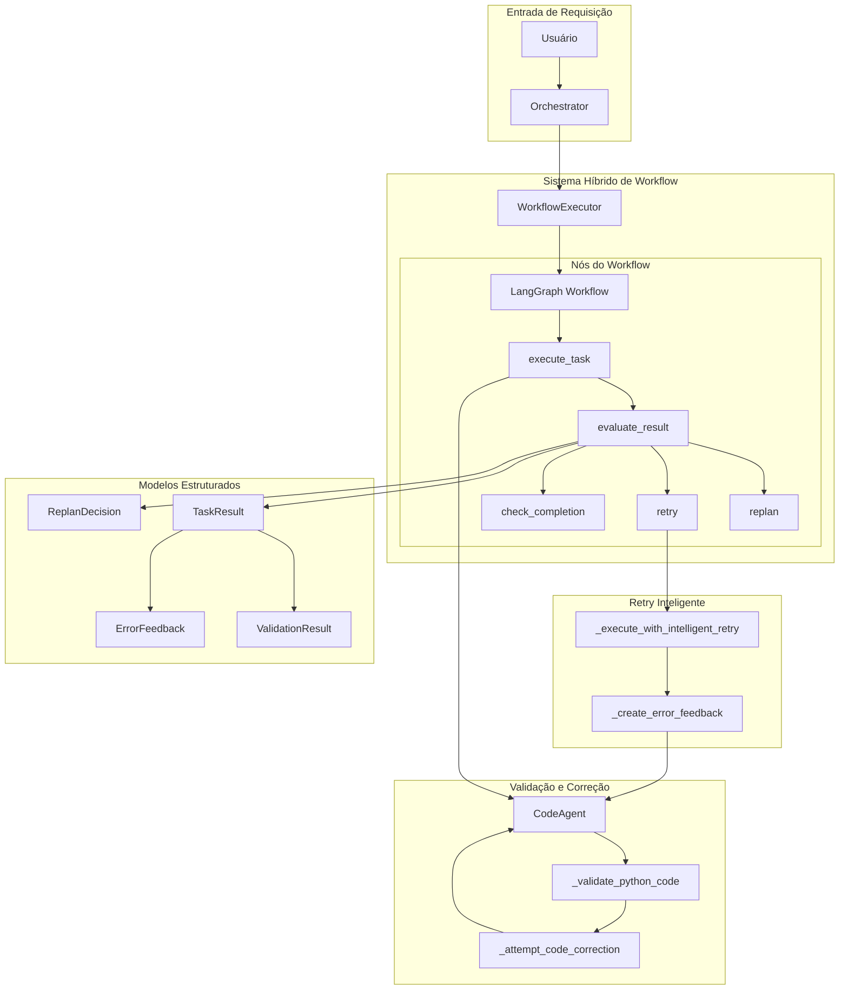

# Sistema Híbrido de Workflow - Documentação Técnica

## Visão Geral

O Sistema Híbrido de Workflow do GTA representa o estado da arte em orquestração inteligente de tarefas, combinando a simplicidade do LangGraph com capacidades avançadas de IA para validação automática, retry inteligente e recuperação de erros.

## Arquitetura do Sistema



## Componentes Principais

### 1. WorkflowExecutor

**Localização**: `agents/workflow_executor.py`

O núcleo do sistema híbrido que gerencia a execução de workflows complexos com capacidades avançadas de recuperação e adaptação.

#### Métodos Principais

##### `_execute_task_hybrid(state: HybridWorkflowState)`
- Executa tarefas individuais com tratamento de erro aprimorado
- Integra retry inteligente baseado em histórico
- Gera resultados estruturados com metadados detalhados

##### `_execute_with_intelligent_retry(task, state, retry_count)`
- Analisa falhas anteriores para ajustar estratégia
- Enriquece contexto baseado em padrões de erro
- Implementa retry adaptativo com learning

```python
# Exemplo de contexto adaptativo
if "syntax" in last_result.output.lower():
    enhanced_context["auto_correct"] = True
    enhanced_context["validation_strict"] = True
elif "import" in last_result.output.lower():
    enhanced_context["check_dependencies"] = True
```

##### `_should_replan(state: HybridWorkflowState)`
- Decisão inteligente sobre replanning vs retry
- Análise estruturada de feedback de erro
- Limites adaptativos de retry baseados em confiança

##### `_create_error_feedback(task, result, state)`
- Categorização inteligente de erros
- Sugestões contextuais de correção
- Recomendações de retry baseadas em análise

### 2. CodeAgent com Validação Automática

**Localização**: `agents/code_agent.py`

#### Novos Métodos de Validação

##### `_validate_python_code(code: str, filename: str)`
```python
def _validate_python_code(self, code: str, filename: str) -> Dict[str, Any]:
    """Validação automática de código Python com análise AST."""
    validation_result = {
        "valid": True,
        "errors": [],
        "warnings": [],
        "suggestions": []
    }
    
    # Validação de sintaxe
    try:
        ast.parse(code)
    except SyntaxError as e:
        validation_result["valid"] = False
        validation_result["errors"].append({
            "type": "syntax_error",
            "line": e.lineno,
            "message": str(e)
        })
    
    # Validação de imports
    # ... análise AST para imports inválidos
    
    return validation_result
```

##### `_attempt_code_correction(code, errors, original_request)`
- Correção automática usando LLM
- Prompts contextuais baseados em tipos de erro
- Limpeza e sanitização de respostas

##### `_handle_code_request(request, context)`
- Integração transparente de validação
- Fluxo automático de correção
- Metadados de validação em resultados

### 3. Modelos Pydantic Estruturados

**Localização**: `orchestra/schemas/task_results.py`

#### TaskResult
```python
class TaskResult(BaseModel):
    task_type: TaskType
    status: TaskStatus
    success: bool
    output: str
    confidence: float
    metadata: Dict[str, Any]
    validation_result: Optional[ValidationResult]
    task_metadata: Optional[TaskMetadata]
```

#### ValidationResult
```python
class ValidationResult(BaseModel):
    valid: bool
    errors: List[Dict[str, Any]]
    warnings: List[Dict[str, Any]]
    suggestions: List[str]
```

#### ErrorFeedback
```python
class ErrorFeedback(BaseModel):
    error_type: str
    error_message: str
    failed_task_id: str
    context: Dict[str, Any]
    suggested_fixes: List[str]
    retry_recommended: bool
```

## Fluxo de Execução

### 1. Execução de Tarefa Normal
```
Requisição → WorkflowExecutor → execute_task → 
CodeAgent → _handle_code_request → _validate_python_code → 
Resultado Estruturado
```

### 2. Fluxo com Validação Falhando
```
Validação Falha → _attempt_code_correction → 
LLM Correction → Nova Validação → 
Resultado com Metadados de Correção
```

### 3. Fluxo com Retry Inteligente
```
Execução Falha → evaluate_result → _should_replan → 
"retry" → _execute_with_intelligent_retry → 
Contexto Enriquecido → Nova Execução
```

### 4. Fluxo com Replanning
```
Múltiplas Falhas → evaluate_result → _should_replan → 
"replan" → _replan_step → Novo Plano → 
Execução com Novo Contexto
```

## Configurações Avançadas

### Variáveis de Ambiente

```bash
# Sistema Híbrido
GTA_WORKFLOW_MAX_RETRIES=3
GTA_WORKFLOW_CONFIDENCE_THRESHOLD=0.5
GTA_VALIDATION_AUTO_CORRECT=true

# Validação de Código
GTA_CODE_VALIDATION_ENABLED=true
GTA_CODE_VALIDATION_STRICT=false
GTA_CODE_AUTO_CORRECTION=true

# Retry Inteligente
GTA_RETRY_LEARNING_ENABLED=true
GTA_RETRY_CONTEXT_ENHANCEMENT=true
```

### Configuração de Logs

```python
# Ativar logs detalhados do workflow
import logging
logging.getLogger('workflow_executor').setLevel(logging.DEBUG)
```

## Métricas e Observabilidade

### Metadados Capturados

- **Execution Time**: Tempo de execução por tarefa
- **Retry Count**: Número de tentativas
- **Confidence Score**: Score de confiança
- **Validation Results**: Resultados de validação
- **Error Categories**: Categorização de erros
- **Correction Attempts**: Tentativas de correção

### Rastreamento de Performance

```python
# Exemplo de metadados em TaskResult
{
    "execution_time": 2.34,
    "retry_count": 1,
    "validation_performed": true,
    "validation_errors": 0,
    "correction_attempted": true,
    "confidence_score": 0.85
}
```

## Casos de Uso Avançados

### 1. Geração de Código com Validação
```python
# O sistema automaticamente:
# 1. Gera código via LLM
# 2. Valida sintaxe Python
# 3. Corrige erros se encontrados
# 4. Retorna código validado com metadados
```

### 2. Workflow Multi-Step com Recovery
```python
# Para workflows complexos:
# 1. Executa cada etapa
# 2. Avalia resultados
# 3. Decide entre retry/replan
# 4. Adapta estratégia baseada em histórico
```

### 3. Análise de Confiança Adaptativa
```python
# Sistema ajusta comportamento baseado em confiança:
# - Alta confiança: prossegue normalmente
# - Média confiança: validação extra
# - Baixa confiança: retry com contexto melhorado
```

## Vantagens Técnicas

### 1. **Resiliência**
- Recuperação automática de falhas
- Retry inteligente com aprendizado
- Replanning dinâmico

### 2. **Qualidade**
- Validação automática de código
- Correção automática de erros
- Garantia de sintaxe válida

### 3. **Observabilidade**
- Metadados estruturados completos
- Rastreamento de decisões
- Histórico de execução detalhado

### 4. **Adaptabilidade**
- Contexto enriquecido baseado em falhas
- Estratégias adaptativas de retry
- Decisões baseadas em confiança

## Futuras Expansões

### 1. **Validação Multi-Linguagem**
- Extensão para JavaScript, TypeScript, etc.
- Validadores específicos por linguagem

### 2. **ML-Enhanced Decision Making**
- Modelos de ML para decisões de retry/replan
- Predição de sucesso baseada em histórico

### 3. **Distributed Workflow**
- Execução distribuída de tarefas
- Balanceamento de carga inteligente

### 4. **Advanced Error Analytics**
- Clustering de tipos de erro
- Sugestões baseadas em padrões históricos
